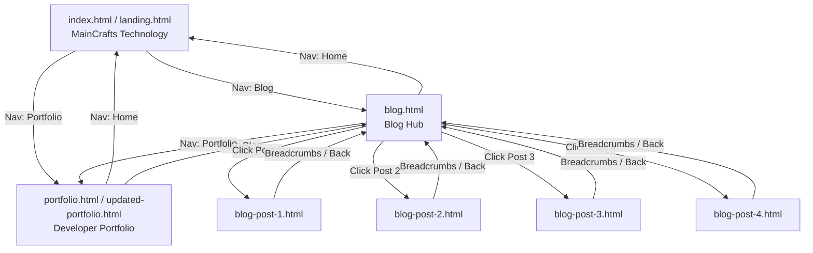

# 🚀 MainCrafts Technology & Portfolio Suite — Complete Project Context & Architecture

> **Purpose:** This document is an all-in-one consolidated project reference designed to provide full context to Claude (or any AI assistant/developer) for immediate understanding, refactoring, feature extension, and design iteration.

---

## 📑 Table of Contents
1. [Executive Project Summary](#1-executive-project-summary)
2. [Complete Directory & File Architecture](#2-complete-directory--file-architecture)
3. [Page-by-Page Breakdown & Technical Map](#3-page-by-page-breakdown--technical-map)
   - [3.1 MainCrafts Landing Page (`index.html` / `landing.html`)](#31-maincrafts-landing-page)
   - [3.2 Sajal Shrivastava Portfolio (`portfolio.html` / `updated-portfolio.html`)](#32-sajal-shrivastava-portfolio)
   - [3.3 Blog Engine & Article Pages (`blog.html` & `blog-post-1..4.html`)](#33-blog-engine--article-pages)
4. [Design System & CSS Token Architecture](#4-design-system--css-token-architecture)
   - [Colors, Gradients & Glassmorphism](#colors-gradients--glassmorphism)
   - [Typography & Layout System](#typography--layout-system)
   - [Animations & Micro-interactions](#animations--micro-interactions)
5. [JavaScript Functional Matrix](#5-javascript-functional-matrix)
6. [Asset Library Manifest](#6-asset-library-manifest)
7. [Documentation Library (`docs/en`) Summary](#7-documentation-library)
8. [Cross-Linking & Navigation Architecture](#8-cross-linking--navigation-architecture)
9. [Identified Inconsistencies & Recommended Next Steps](#9-identified-inconsistencies--recommended-next-steps)
10. [Master Prompt Template for Claude](#10-master-prompt-template-for-claude)

---

## 1. Executive Project Summary

This project is a multi-page, high-performance, dark-themed web platform consisting of three interconnected modules:

1. **MainCrafts Technology Agency Landing Page:** A B2B / SaaS-style agency landing page highlighting cutting-edge software solutions, AI engineering, full-stack development, cloud architecture, stats, testimonials, and interactive contact touchpoints.
2. **Sajal Shrivastava Personal Portfolio:** A developer portfolio showcasing featured engineering projects, tech stack metrics, interactive counters, animated skill meters, and direct contact avenues.
3. **Tech & Engineering Blog Hub:** A fully functional multi-article blog with search, category filtering (All, Tech, Design, Tutorial), reading time indicators, newsletter subscription, and individual long-form article pages.
4. **Documentation Base:** An embedded, comprehensive technical documentation repository (`docs/en`) covering agent workflows, CLI references, hooks, MCP, and configuration.

### Core Tech Stack:
- **Markup:** Semantic HTML5 (with strict ARIA accessibility roles, skip links, and semantic `<header>`, `<main>`, `<section>`, `<nav>`, `<footer>` landmarks).
- **Styling:** Modular CSS3 utilizing CSS Custom Properties (Design Tokens), CSS Grid, Flexbox, Fluid Typography (`clamp()`), and Glassmorphism (`backdrop-filter: blur()`).
- **Scripts:** Vanilla JavaScript (ES6+) for smooth scrolling, mobile drawer navigation, real-time blog search/filter, number counter animations, typing effect, and scroll-reveal via `IntersectionObserver`.
- **Fonts & Icons:** Google Fonts (`Inter`), Font Awesome 6.5.1 CDN.

---

## 2. Complete Directory & File Architecture

```text
MainCraft_Landing Page/
├── index.html                      # Primary landing page entry point (MainCrafts Technology)
├── landing.html                    # Mirror/variant of index.html
├── landing-styles.css              # Stylesheet dedicated to MainCrafts Technology landing page
│
├── portfolio.html                  # Sajal Shrivastava Personal Portfolio
├── updated-portfolio.html          # Cleaned & updated version of portfolio.html
├── portfolio-styles.css            # Stylesheet for personal portfolio (used by both versions)
├── updated-portfolio-styles.css    # Identical backup/synced copy of portfolio-styles.css
│
├── blog.html                       # Blog index with interactive search & tag filtering
├── blog-styles.css                 # Comprehensive styling for blog hub & single article pages
├── blog.js                         # Search, filter, tag selection, & dynamic UI logic
├── blog-post-1.html                # Article: "The Future of Web Development: What to Expect in 2025"
├── blog-post-2.html                # Article: "Mastering CSS Grid: A Comprehensive Guide"
├── blog-post-3.html                # Article: "Building Scalable Cloud Architectures"
├── blog-post-4.html                # Article: "The Rise of AI in Modern Software Engineering"
│
├── design-spec.md                  # Comprehensive 1,150+ line design & component specification
├── README.md                       # Repository overview and GitHub Pages deployment instructions
├── LICENSE                         # MIT License
├── screenshot_hero.png             # Visual preview of portfolio hero section
│
├── assets/                         # Optimized image assets for portfolio & blog
│   ├── hero-bg.png                 # Abstract futuristic gradient mesh backdrop
│   ├── project-ecommerce.png       # Portfolio Project 1 preview
│   ├── project-taskmanager.png     # Portfolio Project 2 preview
│   ├── project-weather.png         # Portfolio Project 3 preview
│   ├── blog-ai.png                 # Blog post 4 cover (AI)
│   ├── blog-cloud.png              # Blog post 3 cover (Cloud Architecture)
│   ├── blog-css-grid.png           # Blog post 2 cover (CSS Grid)
│   └── blog-ux.png                 # Blog post 1 cover (Web Dev / UX)
│
└── docs/                           # Documentation system
    └── en/                         # 100+ markdown reference manuals & CLI guides
```

---

## 3. Page-by-Page Breakdown & Technical Map

### 3.1 MainCrafts Landing Page
- **Files:** `index.html`, `landing.html`, `landing-styles.css`
- **Sections:**
  1. `header.site-header`: Sticky glassmorphic navbar with logo, menu links (`#about`, `#services`, `blog.html`, `portfolio.html`, `#contact`), and mobile toggle.
  2. `section#hero`: High-impact headline ("Crafting Digital Excellence"), dynamic gradient text, dual CTAs ("Explore Services", "Get in Touch"), and floating tech badges.
  3. `section#about`: Company mission, values, and a 4-card stats showcase (500+ Projects, 99% Satisfaction, 24/7 Support, 10+ Years).
  4. `section#services`: 6-card interactive grid (Web Development, Mobile Apps, Cloud Solutions, UI/UX Design, AI & ML Solutions, Cybersecurity) with hover glows.
  5. `section#cta`: High-conversion glassmorphic banner urging collaboration.
  6. `footer.site-footer`: 4-column footer with brand info, quick navigation, services breakdown, newsletter signup, and copyright.

### 3.2 Sajal Shrivastava Portfolio
- **Files:** `portfolio.html`, `updated-portfolio.html`, `portfolio-styles.css`
- **Sections:**
  1. `header.site-header`: Navigation linking to `#about`, `#skills`, `#projects`, `#contact`, with direct links to `landing.html` and `blog.html`.
  2. `section#hero`: Persona intro with animated typing headline ("Full-Stack Developer & Cloud Enthusiast"), resume download button, and social icons (GitHub, LinkedIn, Twitter, Email).
  3. `section#about`: Personal bio + 4 animated metric counters (Projects Completed, Happy Clients, Technologies, Cups of Coffee).
  4. `section#skills`: Interactive categorized skill grid (Frontend, Backend, DevOps, Tools) with proficiency indicators.
  5. `section#projects`: Featured project cards with tech tag badges, hover preview overlays, GitHub source links, and Live Demo buttons.
  6. `section#contact`: Interactive 2-column contact section featuring direct email/phone/location cards and a contact form.
  7. `footer`: Social channels, back-to-top button, and copyright.

### 3.3 Blog Engine & Article Pages
- **Files:** `blog.html`, `blog.js`, `blog-styles.css`, `blog-post-1.html` to `blog-post-4.html`
- **Features:**
  - **Live Search:** Instant client-side filtering matching keywords across titles, excerpts, and tags.
  - **Category Pills:** Filter between "All", "Tech", "Design", "Tutorial", and "Cloud".
  - **Article Cards:** Dynamic cards with thumbnail image, category badge, read-time calculation, author info, and "Read More" button.
  - **Single Post View (`blog-post-*.html`):** Clean reading typography, breadcrumbs, social share buttons, author bio card, syntax-highlighted code blocks, and related posts carousel.

---

## 4. Design System & CSS Token Architecture

Both `landing-styles.css`, `portfolio-styles.css`, and `blog-styles.css` share a unified futuristic dark aesthetic.

### Colors, Gradients & Glassmorphism
```css
:root {
  /* Brand Accents */
  --color-primary: #6c63ff;          /* Electric Violet */
  --color-primary-light: #8b83ff;    /* Violet Hover */
  --color-primary-dark: #5a52e0;     /* Violet Active */
  --color-secondary: #00d4aa;        /* Cyber Teal */
  --color-secondary-light: #33e0be;  /* Teal Hover */
  --color-accent-pink: #ff6584;      /* Accent Coral / Rose */
  --color-accent-amber: #f6c90e;     /* Gold Accent */

  /* Surface & Background Dark Palette */
  --bg-primary: #0a0a14;            /* Deep Space Black (Base) */
  --bg-secondary: #121224;          /* Midnight Navy (Cards / Sections) */
  --bg-tertiary: #1a1a36;           /* Elevated Surfaces */
  --bg-card: rgba(26, 26, 54, 0.6); /* Glassmorphic Card Surface */
  --bg-glass: rgba(18, 18, 36, 0.75);/* Frosted Header / Modals */

  /* Borders & Glows */
  --border-color: rgba(108, 99, 255, 0.15);
  --border-color-hover: rgba(108, 99, 255, 0.45);
  --glass-blur: blur(16px);
  --glow-primary: 0 0 25px rgba(108, 99, 255, 0.35);
  --glow-secondary: 0 0 25px rgba(0, 212, 170, 0.35);

  /* Typography */
  --text-primary: #ffffff;
  --text-secondary: #a0a0c0;
  --text-muted: #6b6b90;
  --font-family: 'Inter', system-ui, -apple-system, sans-serif;
}
```

### Responsive Breakpoints
| Device Tier | Breakpoint | Behavior |
|:---|:---|:---|
| **Desktop Wide** | `> 1200px` | Max container width `1200px`, 3-column project/blog grids |
| **Desktop / Laptop** | `992px – 1200px` | 3-column grids, full navigation bar |
| **Tablet** | `768px – 991px` | 2-column grids, adapted spacing, compact header |
| **Mobile** | `< 768px` | Single-column stack, mobile sliding hamburger menu drawer |

---

## 5. JavaScript Functional Matrix

| Functionality | Implementation Method | Files Applied |
|:---|:---|:---|
| **Mobile Menu Toggle** | Event listeners on `.navbar__toggle`, toggles `.active` & `aria-expanded` | All pages |
| **Scroll Reveal Animations** | `IntersectionObserver` adding `.active` to `.reveal` elements | All pages |
| **Number Counters** | Dynamic requestAnimationFrame / setInterval counting up to `data-target` | `portfolio.html`, `landing.html` |
| **Typing Effect** | Character-by-character typewriter loop with cursor blink | `portfolio.html` |
| **Real-time Blog Search** | Case-insensitive input query against article title & excerpt | `blog.html` (`blog.js`) |
| **Blog Category Filter** | Dataset filtering matching `data-category` against active button | `blog.html` (`blog.js`) |
| **Contact Form Handler** | Client validation + interactive submit state notification | `portfolio.html`, `landing.html` |

---

## 6. Asset Library Manifest

| Asset Name | Dimensions / Format | Usage |
|:---|:---|:---|
| `assets/hero-bg.png` | Web Graphic (PNG) | Backdrop gradient artwork for hero headers |
| `assets/project-ecommerce.png` | 16:9 Screenshot (PNG) | Featured Project: E-Commerce Web App |
| `assets/project-taskmanager.png`| 16:9 Screenshot (PNG) | Featured Project: Task Manager SaaS |
| `assets/project-weather.png` | 16:9 Screenshot (PNG) | Featured Project: Real-time Weather App |
| `assets/blog-ux.png` | 16:9 Blog Cover (PNG) | Blog Post 1: Future of Web Development |
| `assets/blog-css-grid.png` | 16:9 Blog Cover (PNG) | Blog Post 2: Mastering CSS Grid |
| `assets/blog-cloud.png` | 16:9 Blog Cover (PNG) | Blog Post 3: Scalable Cloud Architecture |
| `assets/blog-ai.png` | 16:9 Blog Cover (PNG) | Blog Post 4: AI in Modern Software |
| `screenshot_hero.png` | Fullscreen PNG | README repository preview |

---

## 7. Documentation Library (`docs/en`)

The repository includes an extensive internal knowledge base containing 101 structured markdown documentation files covering:
- AI Agent frameworks, sub-agent choreography, and automated workflows.
- MCP (Model Context Protocol) server integrations and tools reference.
- System prompt templates, sandboxing, and security policies.
- CLI reference, terminal configurations, settings, and developer environment management.

---

## 8. Cross-Linking & Navigation Architecture



---

## 9. Identified Inconsistencies & Recommended Next Steps

1. **Duplicate / Parallel Files:**
   - `index.html` vs `landing.html`: `index.html` references `updated-portfolio.html` while `landing.html` references `portfolio.html`.
   - `portfolio.html` vs `updated-portfolio.html`: `updated-portfolio.html` fixes a small typo (`cfflass` → `class`) and refines menu links.
   - `portfolio-styles.css` and `updated-portfolio-styles.css` are bit-for-bit identical.
   - *Recommendation:* Consolidate `landing.html` into `index.html`, standardize on `portfolio.html` (incorporating fixes from `updated-portfolio.html`), and eliminate redundant files.
2. **Unified CSS Architecture:**
   - Currently, styles are split between `landing-styles.css`, `portfolio-styles.css`, and `blog-styles.css`.
   - *Recommendation:* Extract shared CSS custom properties, resets, utility classes, and navigation styles into a shared `global.css` or `theme.css`.
3. **Contact Form Backend:**
   - Forms currently use client-side placeholders (`event.preventDefault()`). Can be integrated with Formspree, EmailJS, or serverless functions.

---

## 10. Master Prompt Template for Claude

```markdown
Hello Claude! I am working on the MainCrafts Technology web suite.

### Project Context:
- Multi-page modern dark-themed web platform (Agency Landing Page, Developer Portfolio, and 4-Article Tech Blog).
- Tech Stack: Vanilla Semantic HTML5, CSS3 Custom Properties (Glassmorphism, Grid/Flexbox), and Vanilla JS (ES6+).
- Design Spec: Dark palette (#0a0a14 / #121224), primary violet (#6c63ff), secondary teal (#00d4aa), 'Inter' font.

### Files Overview:
- Landing Page: index.html, landing-styles.css, design-spec.md
- Portfolio: portfolio.html, updated-portfolio.html, portfolio-styles.css
- Blog Hub & Posts: blog.html, blog.js, blog-styles.css, blog-post-1.html ... blog-post-4.html
- Images & Assets: assets/

Please review the architectural structure and help me implement the following changes:
[INSERT YOUR DESIRED CHANGES / FEATURES HERE]
```
